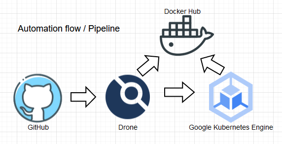

# flight delay prediction backend

**1.** El modelo de prediccion (`pickle_model.pkl`) se ha expuesto utilizando un backend con Flask y Python en `app.py`. Resultado y veredicto de acuerdo documentacion del modelo (clase '1' o 'Atraso', clase '0' o 'No Atraso'). No se considero manejo de errores, excepciones y sanitizacion de los datos. La documentacion del endpoint es la siguiente.

Path: `/predict`

Method: `POST`

Required JSON body example: (data/string) `{ "data": "0,0,0,0,0,0,0,0,0,0,0,0,1,0,0,0,0,0,0,0,0,0,0,1,0,0,0,0,1,0,0,0,0,0,0,0,0" }`

Returns example: (delay/boolean, veredict/string) `{ "delay": false, "verdict": "No Atraso" }`

**2.** El despligue del servicio se automatizo utilizando pipeline como codigo (PaaC) con DroneCI, Docker Hub y Google Kubernetes Engine (GKE), todos servicios cloud. Las llaves para acceder a los servicios se configuraron mediante secrets. El pipeline tiene dos pasos, el primero crea una Docker image utilizando el Dockerfile de la raiz y la empuja a Docker Hub registry, luego despliega la nueva imagen en el cluster GKE.

El pipeline se ejecuta cada vez que hay un evento `push` en la rama principal `main`. Esto permite tener una o mas ramas adicionales para luego condicionar el despligue mediante "Pull Request" u otro evento. Kubernetes deployment, service e ingress definido en `.kube.yml`. Pipeline definido en `.drone.yml` e imagen Docker definida en `Dockerfile`.



**3.** Durante las pruebas de estres, y dada la gran cantidad de request (50k) en solo 45 segundos, fue necesario escalar el servicio con replicas a nivel de cluster, e hilos a nivel de contenedor, logrando buenos resultados y sin indisponer el servicio (timeouts) durante la prueba despues de los cambios. Archivo con la definicion de request esta disponible en `wrk/post.lua`.

Resultados:
```
$ wrk -t6 -c250 -d45s -s wrk/post.lua http://34.72.24.182/predict

Running 45s test @ http://34.72.24.182/predict
  6 threads and 250 connections
  Thread Stats   Avg      Stdev     Max   +/- Stdev
    Latency   113.75ms    4.65ms 201.79ms   94.67%
    Req/Sec   183.22     73.04   400.00     63.67%
  49286 requests in 45.10s, 15.51MB read
Requests/sec:   1092.83
Transfer/sec:    352.18KB
```
*** 
El promedio (avg) de 113 ms es saludable para un servicio alojado en EEUU (`us-central1`) y el trafico que recibio (49286 solicitudes en 45.1 segundos), en cualquier caso es perfectible. Si lo que se busca es mejorar la latencia, aconsejaria utilizar una region mas cercana a los usuarios finales. Por ser contenido no estatico, servicios de cache no serian funcionales.

**4.** La infraestructura necesaria; cluster GKE, VPC y subnets, fueron provisionados con Terraform, todo en el subdirectorio `/terraform`. Para el despliegue inicial se deben editar las dos variables en `terraform/terraform.tfvars`. No se considero el manejo del los archivos de estado.

**5.** Aconsejaria control de acceso mediante API KEY, esto permite un control granular sobre los usuarios, uso y permisos. Hay diversos servicios de API GATEWAY que ofrecen un framework para administrar los accesos y llaves. Agregar autenticacion implica un aumento en la lantencia de respuesta dado los pasos adiciones necesarios en el backend.

**6.** Si el SLA (compromiso cliente) especifica que el servicio estará disponibles el 99,95%, el SLO (objetivo interno) deberia ser probablemente un 99,95% (si aun no se logra) y el SLI seria la medida real de uptime. En este caso para cumplir con el SLA, el SLI deberá ser igual o superar el 99,95%.

Nota: Se omitieron los tildes